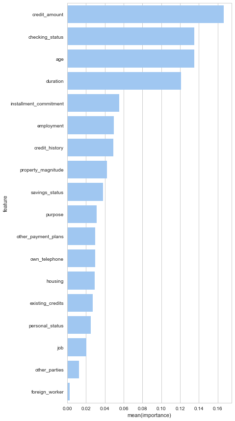
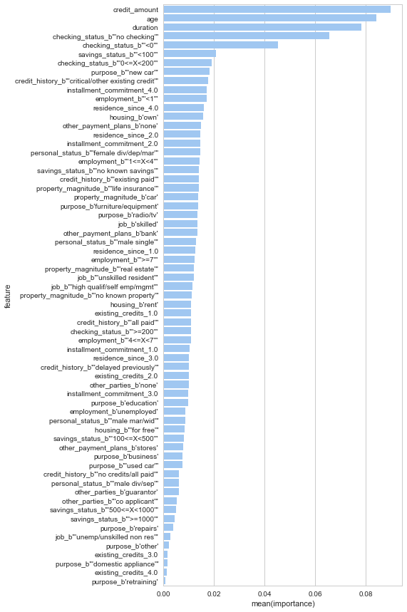

German Credit Datasets analysis
============
Datasets Source : https://www.openml.org/d/31 

* Title: German Credit data

* Number of Instances: 1000

* Number of features: 20

* Target : Good / Bad (70%/30%) 

 : Base Accuracy rate should be above 70% (random choice)
 
 

—
2nd Edition (09/17)
-------------

> Feture Engineering 
=> Set Small size sample of features -> consolidate & resizing 

> Selected Feature 

 

> Cross Validation Result 
using RandomForest Classifier 

{'criterion': 'gini', 'max_depth': 7, 'max_features': 3, 'n_estimators': 100} 
best cross score : 0.765 
test score : 0.755 
Much reduced variance (train & test score) 
but still has a lot of room to improve "Bias" 
 

> Confustion Matrix  
[157,  83],  
[  5, 555]   

FN - 5, FP - 83   
one of the sample data that recoginize the FP is   

index 331 - FP  
index 324 - PP  
 
 
2 sample's are same feature after feature engineering expect Credit Amount and Age  

original featrue  
331 - purpose : 'education', 	savings_statu : '100<=X<500'  
324 - purpose : 'new car', 	savings_statu : 'X<100'  

   

—
1st Edition (09/13)
-------------

> Feature Selection from 

: DecisionTreeClassifier (1)

: RandomForestClassifier (2) and SelectFromModel 

> Selected Features 

 

> Cross Validation Result 

{'criterion': 'gini', 'max_depth': 8, 'max_features': 1, 'n_estimators': 300}  
best cross score : 0.76125  
test score : 0.72  

